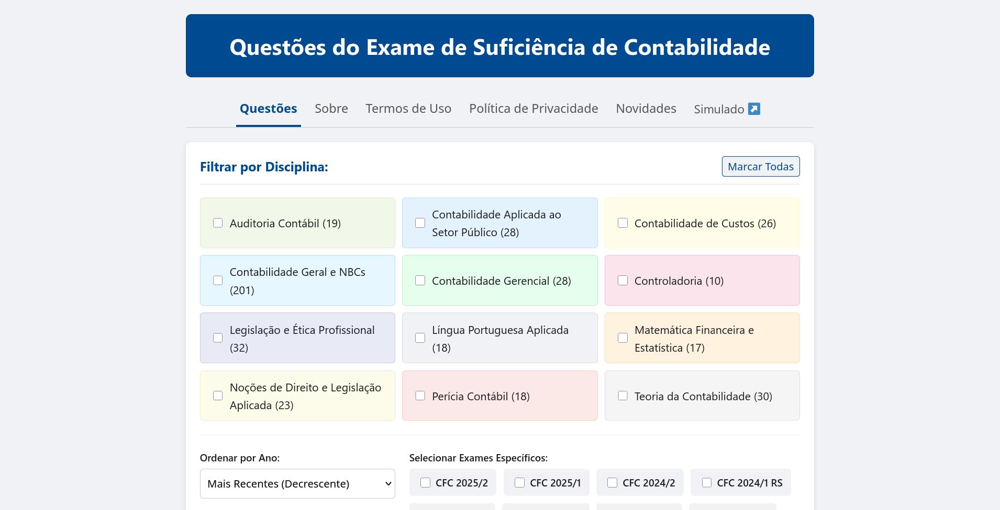
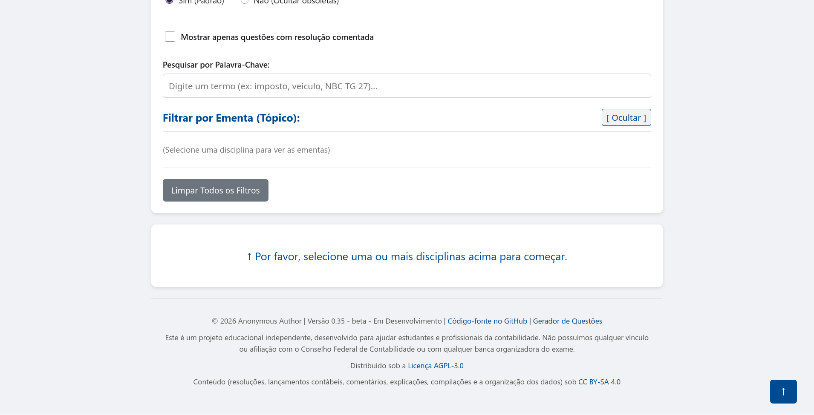
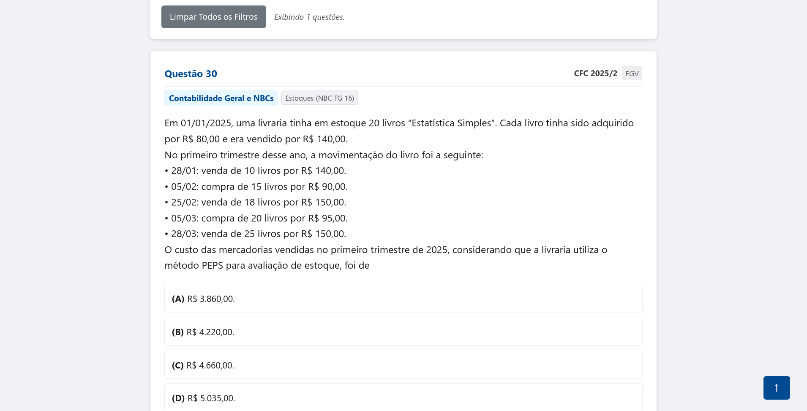
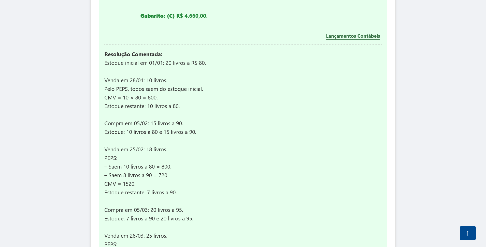
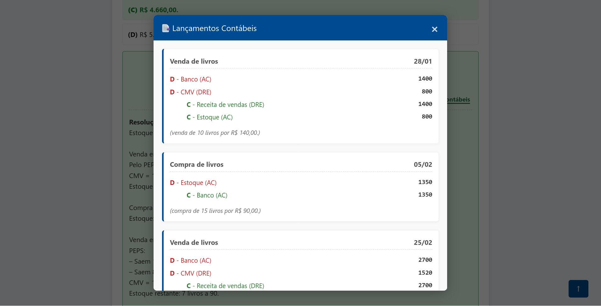
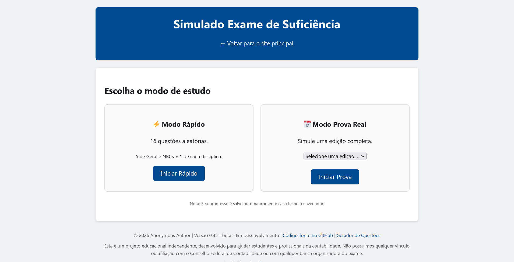

# Repositório do Artigo: Ensino Contábil e Democratização

#### **Seja Bem-Vindo!**

Esse repositório foi criado para armazenar as versões da plataforma online desenvolvida, testes, avaliações e outros documentos que complementam o artigo. Nomes dos autores não serão revelados aqui e os comentários no código do Software referente a autoria foram removidos.

## Versões do site

As versões 0.21 e 0.35 citadas no artigo da Plataforma Online estão disponíveis na pasta [versions](versions).

### **Você também pode interagir o Web Site [aqui](https://anon-article.github.io/anon-article-16-ufsc-ensino-cont-dsr/)).**

## Prompts

- O prompt utilizado para Extração e Classificação das questões pode ser encontrado em [Prompt Extração e Classificação.md](<docs/Prompts/Prompt Extração e Classificação.md>).

- O prompt utilizado para a Persona Contábil pode ser acessado em [Persona Contábil](<docs/Prompts/Persona Contábil.md>).

- A pasta [Google AI Studio](<Google AI Studio>) contém a saída do Gemini e sua parametrização na [Persona](<Google AI Studio/Persona>) e na [etapa 3 - Transformação dos Dados](<Google AI Studio/Transformação dos dados>).

## Script de sanitização presente no Artefato 1

- Versão 0.21: Essa versão possui a API do Google relatado no tópico 4.1 Projeção e Desenvolvimento do Artefato. Acesse [aqui](versions/0.21/etl/main.py). Verifique o [manual](versions/0.21/etl/README.md).

- Versão 0.35: A última versão do script de sanitização de tags pode ser encontrado [aqui](versions/0.35/etl/main.py). Verifique o [manual](versions/0.35/etl/README.md).

## Resultados da Avaliação do Artefato

### Artefato 1

- O arquivo [relatório_geral](<docs/Avaliação do Artefato/Artefato 1/relatorio_geral_comparativo.csv>) refere-se ao arquivo "Quantidade de questões extraídas e oficiais por disciplina". Este é uma das saídas do Artefato 1 e representa a quantidade de questões no relatório estatístico oficial e as que foram extraídas. Importante notar que as edições 2024/2 e 2025/2 foram inseridas manualmente no arquivo [avaliação analítica](<docs/Avaliação do Artefato/Artefato 1/avaliação analítica.xlsx>), pois os dados foram divulgados após o relatório geral estar pronto.

- Tabela 1 Índices de aderência da Classificação Temática do Artefato 1 e a diferença  em relação aos dados oficiais do CFC (2022-2025): É possível acessar a planilha com os cálculos em [avaliação analítica](<docs/Avaliação do Artefato/Artefato 1/avaliação analítica.xlsx>).

- Para a saída do *Script* Python, o [anexo_auditoria_etl](<docs/Avaliação do Artefato/Artefato 1/anexo_auditoria_etl.txt>).

### Artefato 2

- Para o teste funcional, acesse [Teste Funcional](<docs/Avaliação do Artefato/Artefato 2/Teste Funcional.pdf>).

- Para o módulo simulado, acesse a pasta [Simulado](<docs/Avaliação do Artefato/Artefato 2/Simulado/Teste Funcional.pdf>).

# Capturas de tela do site na versão 0.35

### Ponto de interação inicial

### Rodapé informando a licença

### Resultado da aplicação de filtros

### Resolução comentada

### Lançamentos Contábeis

### Modo Simulado

